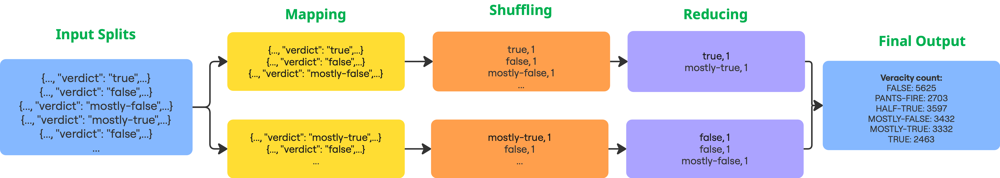
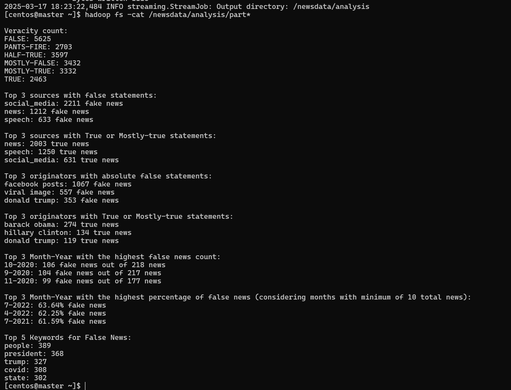
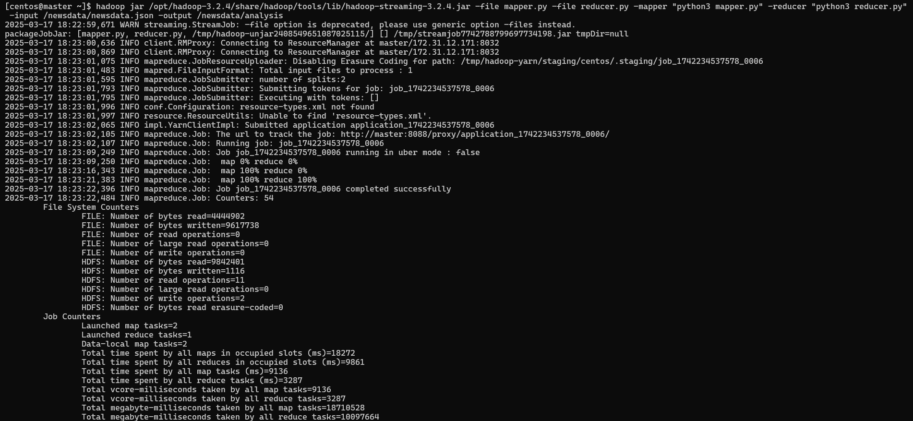
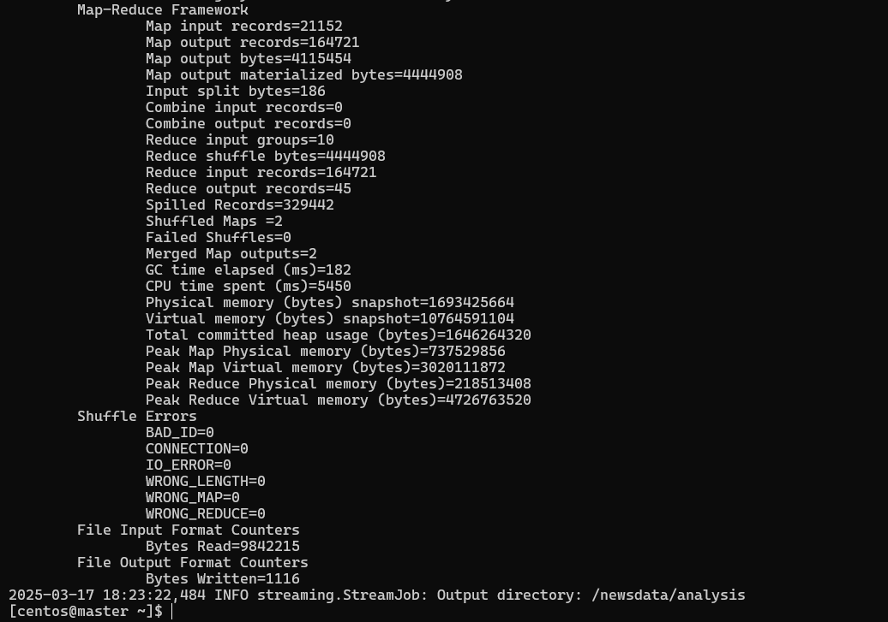

# BDS Assignment - MapReduce

**Group-4**

| 2024mt03579@wilp.bits-pilani.ac.in | Deviprasad Tummidi |
| --- | --- |
| 2024mt03613@wilp.bits-pilani.ac.in | Sandeep Kumar Mishra |
| 2024mt03611@wilp.bits-pilani.ac.in | Aditya Jambhalikar |
| 2024mt03554@wilp.bits-pilani.ac.in | Srivatsa D |

# Problem Statement

**Analysis of News Data: Verifying Source Credibility and Truthfulness**

This project will analyze a dataset of thousands of fact-checked news headlines to analyse the following points

Analysis to be performed:

1. Veracity count e.g. Number of false news, true news and other categories
2. Top 3 sources of most false and true statements e.g. News, social media etc
3. Top 3 originators of false and true statements which could be a person or post
4. Top 3 Month-Year with most false news by count and percentage
5. Top 5 keywords found in false news headlines

# Dataset & Source Information

The dataset has been obtained from Kggle

[https://www.kaggle.com/datasets/rmisra/politifact-fact-check-dataset](https://www.kaggle.com/datasets/rmisra/politifact-fact-check-dataset)

The data has been gathered from a website [PolitiFact](https://www.politifact.com/) which fact checks the news. The news statements has been categorised into 6 categories: true, mostly true, half true, mostly false, false, and pants on fire

It has more than 21k news headlines fact checked

Source of dataset is [rishabhmisra.github.io/publications](https://rishabhmisra.github.io/publications/)

# Map-Reduce Diagrams for each analysis task

**Veracity Count**



**Top Sources with false/true statements**


**Top Originators with false/true statements**


**Top Months with false statements**


**Originators with false/true statements**


# Code

## Pseudo Code

### **mapper.py**

```python
STOP_WORDS = {set of common English words}

def extract_month_year(date_string):
    # extract month-year from date string

def tokenize_and_filter_stop_words(text):
    # filter the line to remove the stop words and create a list of keywords, it will remove words like a, an, the, is, and etc etc and keep keywords

for each line in standard input:
        row = json.loads(line) # parse the JSON
        # Extract the required vars from JSON
    
        headline = "<statement>"
        source = "<statement_source>"
        statement_originator = "<statement_originator>"
        posted_on = "<statement_date>"
        label = "<verdict>"
    
        # print source, label, originator, month-year
    
        if news is false:
                # print source, originator, month-year of news
                # Process the headline for keywords
    
            words = tokenize_and_filter_stop_words(headline)
            for word in words:
                    print("false_news_keyword\t", word)
            
        if news is true:
                # print source, originator
```

### **reducer.py**

```python
# Declare dicts to keep count of label, source, originator, source with fake news and true news, originator with fake and true news, month-year, month-year of fake news, keywords in fake news

for line in sys.stdin:
        # split the input on "\t"
        count each parameter from mapper and store in the dict declared above
    
print count of label
Sort and print top 3 sources of fake news
Sort and print top 3 sources of true news
Sort and print top 3 originators of fake news
Sort and print top 3 originators of true news
Sort and print top 3 month-year with most number of fake news overall

for month_year in month_year_fake_news_count:	
        Get total news for the month_year from month_year count
        Get fake news count for the month_year from month_year_fake_news_count
        
        # Let's consider months-year with at least 10 news
        if total_news > 10:
                # calculate percentage of fake news
        
Sort and print top 3 month-year with highest percentage of fake news
Sort and print top 5 keywords in fake news
```

### Commands executed to perform the analysis:

```bash
# Download the dataset
curl -L -o politifact-fact-check-dataset.zip https://www.kaggle.com/api/v1/datasets/download/rmisra/politifact-fact-check-dataset

# Unzip and rename the file
unzip politifact-fact-check-dataset.zip
mv politifact_factcheck_data.json newsdata.json

# Put the dataset in hdfs
hadoop fs -mkdir /newsdata
hadoop fs -put newsdata.json /newsdata

# Run the job
hadoop jar /opt/hadoop-3.2.4/share/hadoop/tools/lib/hadoop-streaming-3.2.4.jar -file stop_words.json -file mapper.py -file reducer.py -mapper "python3 mapper.py" -reducer "python3 reducer.py" -input /newsdata/newsdata.json -output /newsdata/analysis

# Print the analysis output
hadoop fs -cat /newsdata/analysis/*
```

### Output screenshot



Output screenshot

# Execution Statistics

- Number of Map tasks: 2
- Number of Reduce tasks: 1
- Memory consumption per task:
    - Peak Map Physical memory (bytes)=737529856
    - Peak Map Virtual memory (bytes)=3020111872
    - Peak Reduce Physical memory (bytes)=218513408
    - Peak Reduce Virtual memory (bytes)=4726763520
- Bytes Transferred (**Reduce shuffle bytes**)
    - Map Output Materialized Bytes: 4,444,908 bytes.
    - Reduce Shuffle Bytes: 4,444,908 bytes.

### Execution statistics screenshot



Execution statistics 1



Execution statistics 2